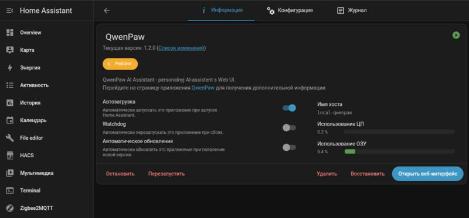

# QwenPaw for Home Assistant


[QwenPaw](https://github.com/agentscope-ai/QwenPaw) — open-source personal AI assistant by AgentScope (Alibaba). Supports any LLM (OpenAI, Qwen, Gemini, Ollama) and messaging channels (Telegram, Discord, DingTalk, and more).

---

[QwenPaw для Home Assistant](https://github.com/agentscope-ai/QwenPaw) — open-source персональный AI-ассистент от AgentScope (Alibaba). Поддерживает любые LLM (OpenAI, Qwen, Gemini, Ollama) и каналы связи (Telegram, Discord, DingTalk и др.).

## Screenshot / Скриншот



## Features / Возможности

- Memory & personalization — the agent remembers context and evolves over time
- 17+ built-in skills: cron, PDF/Office, news, browser, email, multi-agent
- Multi-agent — create multiple agents with different roles
- Multiple channels: Telegram, Discord, DingTalk, Feishu, WeChat, SIP, MQTT, and more
- Multi-layer security (Tool Guard, file access guard, skill scanning)

- Память и персонализация агента
- 17+ встроенных навыков: cron, PDF/Office, news, browser, email, multi-agent
- Multi-agent — несколько агентов с разными ролями
- Множество каналов: Telegram, Discord, DingTalk, Feishu, WeChat, SIP, MQTT и др.
- Многоуровневая безопасность (Tool Guard, file access guard, сканирование навыков)

## Installation / Установка

### Via HA UI / Через интерфейс HA

1. Go to **Settings → Add-ons → Add-on Store → ⋮ → Add repository**
2. Paste: `https://github.com/seoeaa/ha-qwenpaw`
3. QwenPaw will appear in the add-on list — click **Install**
4. After installation click **Start**

1. Перейдите в **Настройки → Дополнения → Магазин → ⋮ → Добавить репозиторий**
2. Вставьте: `https://github.com/seoeaa/ha-qwenpaw`
3. QwenPaw появится в списке дополнений — нажмите **Установить**
4. После установки нажмите **Запустить**

First run takes a few minutes (downloading Docker image ~2GB).

Первый запуск займёт несколько минут (скачивание Docker image ~2ГБ).

### Quick install link / Быстрая ссылка

[](https://my.home-assistant.io/redirect/supervisor_store/?repository_url=https%3A%2F%2Fgithub.com%2Fseoeaa%2Fha-qwenpaw)

## Setup / Настройка

1. Click **Open Web UI** on the QwenPaw add-on card
2. Go to **Settings → Models**
3. Select a provider (OpenAI, Qwen/DashScope, Gemini, Ollama, etc.)
4. Enter your API Key and enable the provider

1. Нажмите **Open Web UI** в карточке QwenPaw
2. Перейдите в **Settings → Models**
3. Выберите провайдера (OpenAI, Qwen/DashScope, Gemini, Ollama и др.)
4. Введите API Key и включите провайдер

## Access / Доступ

| Method | URL |
|--------|-----|
| Web UI (LAN) | `http://<HA_IP>:8088/` |
| Add-on button | "Open Web UI" button on the QwenPaw card |

| Способ | URL |
|--------|-----|
| Web UI (LAN) | `http://<IP_HA>:8088/` |
| Кнопка в дополнении | "Open Web UI" в карточке QwenPaw |

## Options / Параметры

| Option | Default | Description |
|--------|---------|-------------|
| `qwenpaw_port` | 8088 | Web UI port |
| `auth_enabled` | false | Enable authentication for Web UI |

| Параметр | По умолчанию | Описание |
|----------|---------------|----------|
| `qwenpaw_port` | 8088 | Порт Web UI |
| `auth_enabled` | false | Включить авторизацию для Web UI |

## Workspace data / Данные

QwenPaw workspace is stored in `/share/qwenpaw/` — accessible via SSH from any add-on.

Данные QwenPaw хранятся в `/share/qwenpaw/` — доступны по SSH из любого add-on.

```bash
# List workspace files / Список файлов workspace
ls /share/qwenpaw/working/workspaces/default/
```

## Related / Ссылки

- [QwenPaw Repository](https://github.com/agentscope-ai/QwenPaw) — upstream project
- [QwenPaw Documentation](https://qwenpaw.agentscope.io/) — official docs
- [Репозиторий QwenPaw](https://github.com/agentscope-ai/QwenPaw) — оригинальный проект
- [Документация QwenPaw](https://qwenpaw.agentscope.io/) — официальная документация
